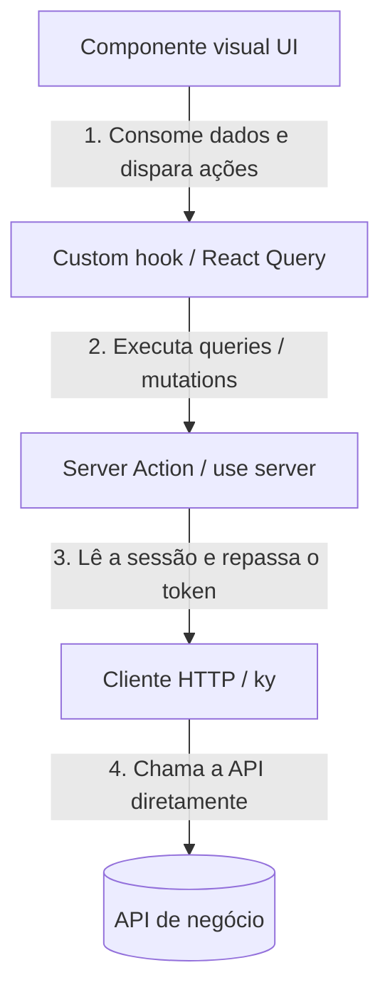

# nextjs-feature-architecture — Arquitetura de features em Next.js

## Contexto da sessão

Features que já existem no projeto:
!`ls -d src/features/*/ 2>/dev/null | sed 's#src/features/##; s#/$##' | head -30 || echo "Nenhuma pasta src/features/ encontrada"`

Instância HTTP compartilhada:
!`test -f src/config/api.ts && echo "src/config/api.ts encontrado" || echo "src/config/api.ts NÃO encontrado — localize a instância ky antes de seguir"`

---

Esta skill define **como estruturar uma feature** que fala com uma API de negócio: a divisão em camadas, o que cada camada pode fazer, e o que conta como "pronto". Use-a como referência consultável por seção, não como um fluxo a executar do começo ao fim.

Ela pressupõe Next.js (App Router) + `ky` + Zod + React Query + MUI. Se o projeto não usa essa stack, aproveite os princípios (separação de camadas, pureza da camada HTTP, uma operação por arquivo) e traduza os nomes de biblioteca para os equivalentes locais.

---

## 1. Estrutura de diretórios de uma feature

Cada feature é auto-contida em `src/features/<FeatureName>`:

```text
src/features/<FeatureName>/
├── actions/             # Server Actions (mutations e leitura no servidor)
│   ├── get-<items>-action.ts
│   ├── get-<item>-action.ts
│   ├── post-<item>-action.ts
│   ├── put-<item>-action.ts
│   └── delete-<item>-action.ts
├── components/          # UI (componentes burros + o controller da feature)
│   └── <FeatureName>/
│       ├── index.tsx    # Controller/orquestrador da feature
│       └── <FeatureName>.test.tsx
├── enums/               # Enums locais da feature
│   └── index.ts
├── hooks/               # Custom hooks (formulários, query string, React Query)
│   ├── use-get-<items>.ts
│   ├── use-get-<item>.ts
│   ├── use-post-<item>.ts
│   ├── use-put-<item>.ts
│   └── use-delete-<item>.ts
├── http/                # Chamadas de rede cruas (instância ky de src/config/api.ts)
│   ├── get-<items>.ts
│   ├── get-<item>.ts
│   ├── post-<item>.ts
│   ├── put-<item>.ts
│   └── delete-<item>.ts
├── schemas/             # Validações Zod, um arquivo por tipo de dado
│   ├── get-<item>.ts
│   ├── post-<item>.ts
│   ├── put-<item>.ts
│   └── delete-<item>.ts
└── types/               # Tipos e interfaces da feature
    └── index.ts
```

**Sem barrel exports em `schemas/`.** Cada arquivo é importado pelo caminho completo (`from "../schemas/<items>-query-params"`), nunca por um `index.ts` que reexporta o diretório inteiro. Barrels escondem de onde cada tipo vem, dificultam a árvore de dependências e podem causar import circular em testes.

`types/index.ts` é uma exceção deliberada: é onde as interfaces puras da feature são **definidas** (incluindo `ActionResult<T>` e `PaginatedResponse<T>`), não um barrel que reexporta `schemas/`.

---

## 2. Responsabilidade das camadas e fluxo de dados

O fluxo é unidirecional e cada camada só fala com a de baixo:



### A. Cliente HTTP e autenticação (`src/config/api.ts`)

Uma **única instância `ky`** apontando direto para o backend. Sem proxy, sem Route Handler intermediário, sem BFF.

```typescript
const API_URL = process.env.NEXT_PUBLIC_API_URL ?? "http://localhost:3333";

export function authHeaders(accessToken: string): Record<string, string> {
  return { Authorization: `Bearer ${accessToken}` };
}

export const api: KyInstance = ky.extend({
  prefix: API_URL,
  timeout: 15_000,
  retry: 0,
  cache: "no-store",
  headers: { Accept: "application/json" },
  hooks: {
    // Troca a mensagem crua do ky pela mensagem que a API devolve no corpo.
    beforeError: [
      /* … */
    ],
  },
});
```

**Regras invioláveis:**

1. **Nunca criar Route Handler proxy** (`app/api/**`) para repassar chamadas à API de negócio. Isso adiciona um salto de rede inútil, duplica tratamento de erro e quebra em Server Actions: `fetch` no servidor não tem base URL implícita como no browser, então um caminho relativo tipo `/api/backend` não resolve. Server Actions rodam no mesmo processo Node e falam com o backend diretamente.
2. **Nunca instanciar `ky`/`fetch`/`axios` avulso dentro de uma feature.** Toda chamada passa pela instância compartilhada, para herdar timeout, tratamento de erro e headers padrão.
3. **A instância não injeta auth.** Endpoints públicos (login, register) a usam direto; endpoints autenticados recebem `headers: authHeaders(accessToken)`.
4. **O tenant nunca vai no request.** O backend o extrai do próprio token — nunca do body, da query ou de um header.

### B. HTTP (`http/`)

Faz as chamadas de rede cruas. **Camada pura**: não lê cookies, não acessa `next/headers`, não valida — recebe tudo por parâmetro e devolve a resposta tipada. É isso que a mantém testável sem mockar o runtime do Next.

```typescript
import { api, authHeaders } from "@/config/api";
import type { PaginatedResponse, Item } from "../types";
import type { ItemsQueryParams } from "../schemas/items-query-params";

export async function getItems(
  params: ItemsQueryParams,
  accessToken: string,
): Promise<PaginatedResponse<Item>> {
  return api
    .get("items", {
      headers: authHeaders(accessToken),
      searchParams: {
        page: params.page,
        perPage: params.perPage,
        ...(params.search ? { search: params.search } : {}),
      },
    })
    .json<PaginatedResponse<Item>>();
}
```

O `accessToken` chega **sempre como parâmetro**, nunca é lido de dentro da função.

### C. Server Actions (`actions/`)

Funções assíncronas rodando estritamente no servidor (`"use server"`).

São a ponte segura: é **aqui, e só aqui**, que a sessão é lida, o input é validado com Zod e o token é repassado para `http/`. Sempre retornam `{ success, message, data? }` e **nunca lançam**.

```typescript
"use server";

import { getServerSession, SESSION_EXPIRED_MESSAGE } from "@/lib/session";
import { getItems } from "../http/get-items";
import type { ActionResult, PaginatedResponse, Item } from "../types";
import type { ItemsQueryParams } from "../schemas/items-query-params";

export async function getItemsAction(
  params: ItemsQueryParams,
): Promise<ActionResult<PaginatedResponse<Item>>> {
  const session = await getServerSession();
  if (!session) return { success: false, message: SESSION_EXPIRED_MESSAGE };

  try {
    const data = await getItems(params, session.accessToken);
    return { success: true, message: "Sucesso", data };
  } catch (error) {
    console.error("[Get Items Action Error]", error);
    return {
      success: false,
      message: error instanceof Error ? error.message : "Erro inesperado",
    };
  }
}
```

#### Ações restritas por papel (admin)

Quando o endpoint no backend exige um papel específico, a proteção vive em **três camadas** — nenhuma substitui a outra:

1. **UI** (um hook do provider de sessão, ex.: `useIsAdmin()`): esconde botões e a coluna de ações. É conveniência visual, não segurança.
2. **Server Action** (um helper de sessão, ex.: `requireAdmin()`): barra antes de gastar a chamada HTTP e devolve mensagem em português.
3. **Backend**: a checagem de papel é a autoridade final — responde 403 mesmo se as duas camadas acima forem contornadas.

```typescript
"use server";

import {
  FORBIDDEN_MESSAGE,
  requireAdmin,
  SESSION_EXPIRED_MESSAGE,
} from "@/lib/session";

export async function postItemAction(input: CreateItemSchema) {
  const auth = await requireAdmin();
  if (!auth.ok) {
    return {
      success: false,
      message:
        auth.reason === "forbidden"
          ? FORBIDDEN_MESSAGE
          : SESSION_EXPIRED_MESSAGE,
    };
  }
  // … valida com Zod e chama a camada http/ com auth.session.accessToken
}
```

> Leitura costuma ser liberada para qualquer papel. Confira o controller do backend antes de assumir: restringir demais esconde dado que papéis operacionais precisam ver.

### D. Custom hooks e React Query (`hooks/`)

Camada de controle de estado e sincronização assíncrona. Todo fetch e toda mutation ficam encapsulados em hooks com `useQuery` / `useMutation`.

```typescript
"use client";

import { useQuery } from "@tanstack/react-query";
import { getItemsAction } from "../actions/get-items-action";
import type { ItemsQueryParams } from "../schemas/items-query-params";

export const ITEMS_QUERY_KEY = ["items"] as const;

export function useItems(params: ItemsQueryParams) {
  const { data, isLoading, isFetching, error, refetch } = useQuery({
    queryKey: [...ITEMS_QUERY_KEY, params],
    queryFn: async () => {
      const result = await getItemsAction(params);
      if (!result.success) throw new Error(result.message);
      return result.data;
    },
    placeholderData: (previousData) => previousData,
  });

  return {
    items: data?.data ?? [],
    meta: data?.meta,
    isLoading,
    isFetching,
    error,
    refetch,
  };
}
```

**Sessão expirada não se trata em cada hook.** Configure `queryCache` e `mutationCache` no `QueryProvider` com um `onError` que detecta a mensagem estável de sessão expirada em **qualquer** query ou mutation, chama o logout e redireciona para o login. Um projeto real tentou resolver isso com um guard por hook: cobria as leituras, mas nenhuma das ~20 mutations tinha a checagem, então uma sessão morta numa escrita só mostrava o erro genérico e nunca deslogava. Centralizar no `QueryClient` resolve de uma vez — não adicione esse tratamento em hooks novos.

Mutations usam `useMutation` + o hook global de snackbar (ver seção 3) e invalidam a query da listagem no sucesso:

```typescript
export function useCreateItem() {
  const queryClient = useQueryClient();
  const snackbar = useSnackbar();

  return useMutation({
    mutationFn: async (input: CreateItemSchema) => {
      const result = await postItemAction(input);
      if (!result.success) throw new Error(result.message);
      return result.data;
    },
    onSuccess: () => {
      snackbar.showSuccess("Item cadastrado.");
      queryClient.invalidateQueries({ queryKey: ITEMS_QUERY_KEY });
    },
    onError: (error) => snackbar.showError(error.message),
  });
}
```

**`mutateAsync` exige `try/catch`.** Diferente de `mutate()`, o `mutateAsync()` **relança o erro** depois de rodar o `onError` do hook. Todo `await xyz.mutateAsync(...)` dentro de um `onSubmit`/`handleConfirm` precisa de `try/catch` — mesmo com o `catch` vazio, já que o snackbar já cobriu a mensagem. Sem isso, o primeiro erro real relança pelo `await` desprotegido, vira exceção não capturada e **derruba a página inteira**. Isso aconteceu de verdade em 9 dialogs de um projeto antes de ser corrigido.

```typescript
const onSubmit = handleSubmit(async (values) => {
  try {
    await createItem.mutateAsync(values);
    onOpenChange(false); // só fecha o dialog se a mutation teve sucesso
  } catch {
    // Erro já exibido pelo snackbar via onError do hook — dialog segue aberto.
  }
});
```

Se o dialog **não** precisa aguardar o resultado (ex.: transição de status disparada direto no menu de ações de uma tabela), prefira `.mutate()` — é fire-and-forget, nunca relança e não precisa de `try/catch`.

**Filtros e query string ficam num hook próprio**, separado do hook de dados. O debounce escreve na URL (`searchParams`) e o hook de dados apenas lê os parâmetros:

```typescript
"use client";

import { useCallback, useEffect } from "react";
import { usePathname, useRouter, useSearchParams } from "next/navigation";
import { useForm, useWatch } from "react-hook-form";

export function useItemsFiltersState() {
  const router = useRouter();
  const pathname = usePathname();
  const searchParams = useSearchParams();

  const page = Number(searchParams.get("page") ?? "1");
  const perPage = Number(searchParams.get("perPage") ?? "10");
  const urlSearch = searchParams.get("search") ?? "";

  const { control, reset } = useForm({ defaultValues: { search: urlSearch } });
  const watchedSearch = useWatch({ control, name: "search" });

  const updateParams = useCallback(
    (updates: Record<string, string | null>) => {
      const params = new URLSearchParams(searchParams.toString());
      Object.entries(updates).forEach(([key, value]) => {
        if (value === null || value === "") params.delete(key);
        else params.set(key, value);
      });
      router.replace(`${pathname}?${params.toString()}`);
    },
    [searchParams, pathname, router],
  );

  useEffect(() => {
    const handler = setTimeout(() => {
      if (watchedSearch !== urlSearch) {
        updateParams({ search: watchedSearch ?? "", page: "1" });
      }
    }, 500);
    return () => clearTimeout(handler);
  }, [watchedSearch, urlSearch, updateParams]);

  return {
    control,
    page,
    perPage,
    urlSearch,
    updateParams,
    clearFilters: () => {
      reset({ search: "" });
      updateParams({ search: null, page: "1" });
    },
  };
}
```

> Confirme a convenção de paginação da API antes de mexer nos filtros. Muitas APIs são **1-indexed** (`page: 1` é a primeira página), enquanto componentes de tabela costumam assumir 0-indexed. O hook de filtros segue a convenção da API; quem converte é o wrapper do DataGrid, não o contrário.

### E. Componentes (`components/`)

Camada estritamente visual. Exibe informação e captura intenção do usuário.

- Não instanciam estado de `react-hook-form`, não gerenciam chaves de cache, não chamam actions direto. Consomem as saídas dos hooks.
- UI com Material UI: componha primitivas do MUI (`Box`, `Stack`, `TextField`, `Dialog`, `Alert`) ou os componentes globais do projeto — nunca HTML cru estilizado à mão. Exceção: um sistema visual separado (ex.: site institucional) pode ter regras próprias.
- O `components/<FeatureName>/index.tsx` é o **controller**: consome os hooks de estado e de dados, decide renderizações globais (loading, erro) e distribui props para subcomponentes burros.

```typescript
"use client";

export const ItemManagement = () => {
  const { control, page, perPage, urlSearch, updateParams, clearFilters } = useItemsFiltersState();
  const { items, meta, isLoading, error, refetch } = useItems({
    page,
    perPage,
    search: urlSearch || undefined,
  });

  const [formOpen, setFormOpen] = useState(false);

  if (error) {
    return (
      <Alert
        severity="error"
        action={<Button color="inherit" size="small" onClick={() => refetch()}>Tentar novamente</Button>}
      >
        {error.message}
      </Alert>
    );
  }

  return (
    <Paper elevation={1} sx={{ p: 2, display: "flex", flexDirection: "column", gap: 2 }}>
      <Box sx={{ display: "flex", justifyContent: "space-between", gap: 2 }}>
        <ItemFilters control={control} onClear={clearFilters} />
        <Button variant="contained" startIcon={<AddIcon />} onClick={() => setFormOpen(true)}>
          Novo item
        </Button>
      </Box>
      <ItemsTable items={items} meta={meta} loading={isLoading} onUpdateParams={updateParams} />
      <ItemFormDialog open={formOpen} onOpenChange={setFormOpen} />
    </Paper>
  );
};
```

Tabelas de listagem usam o DataGrid genérico do projeto, que já resolve a conversão de paginação entre API e componente. Ações de linha (editar, remover) entram como itens de menu de ações (`GridActionsCellItem` com `showInMenu`), não como ícones soltos. `checkboxSelection` só entra quando a feature realmente consome a seleção (ação em lote, ou impedir a exclusão da própria conta) — não é padrão.

---

## 3. Reuso e utilitários globais de UI

**Nunca recrie o que o projeto já tem.** Procure o utilitário global antes de escrever um local:

- **Alertas e notificações (snackbar)**: use o provider global de snackbar em vez de repetir `useState` de abertura/severidade em cada componente. Monte-o uma vez no provider de tema e consuma com um hook (`snackbar.showSuccess("Operação realizada!")`, `showError("Erro inesperado!")`, `showInfo("...")`).
- **Máscaras de digitação** (telefone, CPF, documentos): use o componente de campo mascarado do projeto + os padrões prontos de utilitário. **Nunca** implemente máscara na mão com `onChange` + regex — o comportamento de cursor/backspace no meio do valor é sutil o bastante para já ter causado bugs reais, especialmente com padrões de prefixo comum (tipo "10 ou 11 dígitos").
- **Select de entidade** (uma lista que só cresce: clientes, profissionais, categorias): use um componente de autocomplete de entidade ligado a `id`/`getOptionLabel`/loading. `TextField select` + `MenuItem` **não filtra por digitação** e, em listas maiores, o valor escolhido nem aparece bem refletido no label. Reserve `TextField select` para listas curtas e fixas com uma opção "Todos" (ex.: filtro de status), onde a feature real é "resetar para tudo", não buscar.
- **Campo de data/hora**: use os componentes de date-picker da stack (`@mui/x-date-pickers` com `dayjs`), nunca `<TextField type="date">` ou `<input type="datetime-local">` — o input nativo não tem estilo consistente com o MUI e aparece vazio (`dd/mm/yyyy, --:--`) quando não há valor. O `LocalizationProvider` (locale `pt-br`) fica montado uma vez no provider de tema; o schema Zod continua guardando a data como string ISO.

  **Armadilha real:** o `onChange` do `DatePicker`/`DateTimePicker` dispara a cada segmento digitado (dia, mês, ano), não só quando a data fica completa — e o `value` recebido não é `null` enquanto ela está parcial, é um `Dayjs` **inválido**. Chamar `.toISOString()` direto lança `RangeError: Invalid time value`, que cai num `console.error` silencioso: o usuário digita a data e nada acontece, sem explicação. Sempre valide antes de converter:

  ```typescript
  const handleDateChange = (value: Dayjs | null) => {
    if (!value || !value.isValid()) {
      if (!value) onChange(null); // só limpa no null explícito
      return; // ainda digitando — não faz nada
    }
    onChange(value.toISOString());
  };
  ```

---

## 4. Nomenclatura e organização

- **Hooks**: prefixo `use-`, separados por hífen e verbosos (`use-<item>.ts`, `use-<item>-filters-state.ts`).
- **Actions**: sufixo `-action.ts` (`get-<items>-action.ts`, `post-<item>-action.ts`).
- **http**: só a operação (`get-<items>.ts`, `post-<item>.ts`).
- **Componentes**: PascalCase em pastas e arquivos (`ItemFilters.tsx`).
- **Schemas**: um arquivo por tipo de dado (`<item>.ts`, `<items>-query-params.ts`), sem barrel.
- **Testes**: `.test.tsx` / `.test.ts` no mesmo diretório do arquivo testado.

---

## 5. Refatorando uma feature legada

Ao encontrar um componente gigante com lógica misturada, siga esta ordem — cada passo deixa o sistema funcionando:

1. **Mapear.** No componente legado, identifique cada `fetch` nativo, `useState` de paginação/filtro, `useEffect` observando URL e schema Zod inline. Classifique cada operação como leitura (query) ou escrita (mutation).
2. **Extrair a camada HTTP.** Um arquivo por endpoint em `http/`, trocando `fetch` nativo pela instância compartilhada e recebendo o `accessToken` por parâmetro.
3. **Decompor schemas e tipos.** Quebre o arquivo de schemas sobrecarregado em um por tipo de dado (sem barrel). Mova tipos puramente TypeScript para `types/index.ts`, incluindo `ActionResult<T>`.
4. **Criar as Server Actions.** Um arquivo por operação em `actions/`, com `"use server"` no topo, validação Zod, leitura de sessão e retorno `{ success, message, data? }` dentro de `try/catch`.
5. **Construir os custom hooks.** Extraia query string, debounce e paginação para um hook de filtros; encapsule cada query/mutation em um hook de React Query que invalide a chave certa no sucesso.
6. **Simplificar os componentes.** Remova do componente principal todo `useState`/`useForm`/`useQuery`. Ele deve apenas instanciar os hooks do passo 5 e distribuir props. Quebre o JSX em subcomponentes focados (`<ItemFilters />`, `<ItemTable />`, `<ItemStatusToggle />`).
7. **Reorganizar os testes.** Mova os testes para o lado do arquivo que testam e ajuste os `vi.mock` para os caminhos individuais, em vez de barrels.

---

## 6. Critérios de aceite (Definition of Done)

Qualquer desvio impede a feature de ser considerada concluída:

1. **Zero lógica acoplada nos componentes.** Proibido `useState` para paginação, filtros, debounce ou status de requisição na UI. Proibido instanciar `useForm` ou schemas Zod em componente visual. O componente é declarativo e delega 100% da lógica aos hooks.
2. **Tipagem única e centralizada.** Proibido duplicar tipos entre arquivos (ex.: tipo de resposta definido no `http/` e repetido na action ou na view). Schemas de validação em `schemas/`, interfaces puras em `types/index.ts`.
3. **Arquivos focados (SRP).** Proibido acumular vários endpoints em um arquivo de requisições ou vários fluxos numa Server Action. Cada operação tem seu arquivo (`get-items.ts`, `patch-item.ts`, `delete-item.ts`).
4. **Erros tratados e estados resilientes.** Proibido deixar erro de requisição estourar sem tratamento (tela branca ou loader infinito). Server Action e hook de query tratam com `try/catch` e retornam fallback consistente. Sessão expirada e indisponibilidade do servidor devem levar a logout/redirect estruturado ou a um componente de erro dedicado.
5. **Testes unitários obrigatórios.** Proibido entregar componente, hook ou utilitário sem teste do comportamento esperado e das ramificações de erro, com mocks limpos de rede e rota. A regra completa — o que sempre precisa de teste, o que é isento e a trava determinística (script + hook + CI) — está na skill `unit-testing-standards`.
6. **Acesso à API sem camadas intermediárias.** Proibido Route Handler proxy em `app/api/**`, `ky`/`fetch`/`axios` avulso dentro da feature, e leitura de cookies ou `next/headers` na camada `http/`. Toda chamada usa a instância única de `src/config/api.ts`; a Server Action lê a sessão e passa o `accessToken` como parâmetro — ver [seção 2.A](#a-cliente-http-e-autenticação-srcconfigapits).
